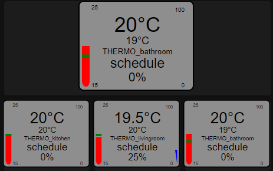

# Lovelace thermo-valve-gauge

A Home Assistant lovelace custom gauge card for climate instantiated by a thermometer valve such as [TuYa TS0601_thermostat](https://www.zigbee2mqtt.io/devices/TS0601_thermostat.html).



## Usage
Add this card via HACS (recommended)

Or manually :
Add this custom card to your home assistant instance. Reference it into your lovelace configuration.
```
  - type: js
    url: /local/lovelace/mini-thermo-valve-gauge.js
```

Finally :
Add it as a custom card to your lovelace : `'custom:thermo-valve-gauge'`.

## Options
### Card options
| **Option** | **Type** | **Description** |
|-|:-:|-|
| `entity` ***(required)*** | string | an entity to track, make sure it is a climate entity |
| `temp_min` ***(required)*** | number | minimum value of the temperature gauge |
| `temp_max` ***(required)*** | number | maximum value of the temperature gauge |
| `measurement` | string | custom unit of measurement |
| `scale` | number | sizing factor, deafult = 1 |
| `decimals` | number | decimal precision of entity value. |

An example for a picture-element:
```yaml
type: picture-elements
elements:
  - type: custom:thermo-valve-gauge
    temp_max: 25
    temp_min: 15
    measurement: °C
    entity: climate.thermo_livingroom
    scale: 1.5
    style:
      top: 75%
      left: 38%
```

An example for a card:
```yaml
type: custom:thermo-valve-gauge
temp_max: 25
temp_min: 15
measurement: °C
entity: climate.thermo_bathroom
scale: 2
style:
```

Time to time upgrading, mainly for my own purpose, anyway feel free to reuse ! 
PR are welcome and i can have a look to features requests.

Thanks to [SNoof85](https://github.com/SNoof85/lovelace-tempometer-gauge-card) for inspiration.
